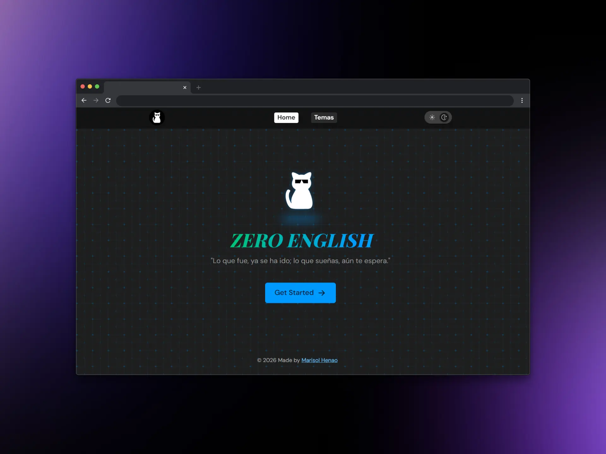

# 💡 Proyecto / Zero English 🗣️ <!-- omit in toc -->

### Contenido <!-- omit in toc -->


- [Contexto](#contexto)
  - [Nombre](#nombre)
  - [Problema](#problema)
  - [Solución basada en la nube](#solución-basada-en-la-nube)
- [🛠️ Tecnologías utilizadas](#️-tecnologías-utilizadas)
- [🔢 Pasos para el desarrollo](#-pasos-para-el-desarrollo)
- [🚀 MVP](#-mvp)
  - [Posibles implementaciones futuras](#posibles-implementaciones-futuras)
- [☁️ Implicación de la nube](#️-implicación-de-la-nube)
- [🧱 Arquitectura que evidencia el trabajo técnico](#-arquitectura-que-evidencia-el-trabajo-técnico)
  - [Situación problema](#situación-problema)
  - [Análisis de Requerimientos](#análisis-de-requerimientos)
  - [Flujo de datos](#flujo-de-datos)
  - [Diagrama de flujo conceptual](#diagrama-de-flujo-conceptual)
  - [Capas de la arquitectura](#capas-de-la-arquitectura)
  - [Justificación de decisiones técnicas](#justificación-de-decisiones-técnicas)
  - [Seguridad aplicada](#seguridad-aplicada)
  - [Escalabilidad contemplada](#escalabilidad-contemplada)
- [💰 Presupuesto estimado para la implementación](#-presupuesto-estimado-para-la-implementación)


## Contexto

### Nombre

"Diseño de una arquitectura en la nube para una plataforma de aprendizaje de inglés basada en contenidos Markdown."

### Problema

Un estudiante de inglés organiza sus apuntes, ejercicios, audios y documentos en carpetas de su computador personal. Esta forma de almacenamiento presenta varias dificultades:

- El contenido solo está disponible en el equipo donde fue guardado.
- No puede continuar el estudio fácilmente desde el celular, una tablet o otro computador.
- Existe riesgo de pérdida de información por daño del disco, robo del equipo o eliminación accidental.
- Compartir material con otros estudiantes requiere enviarlo manualmente por correo o mensajería.
- El mantenimiento y respaldo dependen completamente del usuario.    

Como consecuencia, el proceso de aprendizaje se vuelve poco flexible, inseguro y difícil de mantener a largo plazo.

### Solución basada en la nube

Se propone desarrollar una plataforma web estática de aprendizaje de inglés desplegada en un servidor cloud de Linode, accesible mediante un dominio propio y conexión HTTPS. Las lecciones estarán almacenadas de forma centralizada y publicadas como páginas web generadas desde archivos Markdown.

La solución aprovecha la nube de la siguiente manera:

- **Acceso ubicuo:** el estudiante puede consultar el contenido desde cualquier dispositivo con Internet.
- **Disponibilidad permanente:** el servidor permanece encendido 24/7, independientemente del estado del computador del estudiante.
- **Centralización del contenido:** todas las lecciones se administran en un único repositorio, facilitando actualizaciones y mantenimiento.
- **Seguridad:** el acceso se realiza mediante HTTPS y el servidor puede protegerse con firewall y autenticación SSH.
- **Respaldo y recuperación:** la infraestructura cloud permite realizar snapshots o copias de seguridad del servidor.
- **Escalabilidad:** si aumenta la cantidad de usuarios o contenido, los recursos del VPS pueden ampliarse sin rediseñar la aplicación.
- **Portabilidad:** el código y los contenidos quedan versionados en GitHub, permitiendo restaurar o migrar el proyecto fácilmente.


## 🛠️ Tecnologías utilizadas

| Componente           | Tecnología                    |
| -------------------- | ----------------------------- |
| Generador del sitio  | Astro                         |
| Contenido            | Markdown Collections          |
| Estilos              | Tailwind CSS                  |
| Control de versiones | Git + GitHub                  |
| Servidor web         | Nginx                         |
| Sistema operativo    | Ubuntu Server 24.04           |
| Entorno de ejecución | Node.js 22 LTS                |
| Plataforma cloud     | Linode (Akamai Cloud)         |
| Dominio              | GitHub Student Developer Pack |
| Certificados SSL     | Let’s Encrypt + Certbot       |
| Acceso remoto        | SSH                           |

## 🔢 Pasos para el desarrollo

- **Definición y control de versiones:** Inicializar el proyecto localmente con **Astro** y **Markdown**, versionando el código mediante **Git** y respaldándolo en un repositorio remoto en **GitHub**.
- **Aprovisionamiento del servidor cloud:** Crear y configurar una instancia de servidor virtual (VPS) en **Linode** con **Ubuntu Server**, asegurando el acceso remoto mediante **SSH**.
- **Configuración del servidor web:** Instalar y configurar **Nginx** como servidor web de alto rendimiento (aprovechando que el sitio es estático, se puede servir directamente tras el proceso de _build_, reduciendo el consumo de memoria y optimizando la seguridad).
- **Vinculación de dominio:** Conectar el dominio personalizado obtenido a través del **GitHub Student Developer Pack** hacia la dirección IP del servidor.
- **Seguridad y despliegue final:** Activar el protocolo **HTTPS** utilizando certificados SSL gratuitos de **Let's Encrypt con Certbot** y realizar el primer despliegue de la plataforma en producción.

La ejecución de los pasos en el orden propuesto funciona muy bien por **va de adentro hacia afuera:** Primero se construye el sitio y se asegura el código (Astro + GitHub), luego se prepara la casa en la nube (Linode + Nginx), y finalmente se conecta la cara pública (Dominio + HTTPS).

## 🚀 MVP

Para el taller ABP se propone un MVP (producto mínimo viable) con:

- Página de inicio.
- Lista de lecciones de inglés.
- Lecciones escritas en Markdown.
- Navegación entre temas.
- Diseño responsive para móvil y computador.
- Modo claro/oscuro
- Dominio personalizado
- HTTPS activo.
- Búsqueda simple de lecciones (pendiente)
- Despliegue público en Linode.

### Posibles implementaciones futuras

Como evolución del sistema se propone:

- Base de datos para almacenamiento del contenido.
- Panel administrativo para crear contenido desde la web.
- Registro e inicio de sesión.
	- Seguimiento del progreso de aprendizaje.
	- Marcado de lecciones favoritas.

## ☁️ Implicación de la nube

La nube se evidencia en la infraestructura utilizada:

- **Infraestructura bajo demanda:** El servidor virtual se crea desde el panel de Linode en minutos, sin necesidad de comprar hardware físico.
- **Acceso global:** La plataforma está disponible desde cualquier parte del mundo con conexión a Internet.
- **Seguridad:** Se utiliza autenticación en el servidor y HTTPS con certificado SSL emitido por Let's Encrypt.
- **Persistencia:** Los contenidos permanecen almacenados en el servidor cloud aunque el computador del desarrollador esté apagado.
- **Escalabilidad:** El VPS puede aumentar CPU, RAM o almacenamiento desde el panel de Linode sin reinstalar la aplicación.
- **Respaldo y recuperación:** Linode ofrece snaptshots y copias de seguridad del servidor para recuperación ante fallos.

Con todo esto el proyecto estaría cumpliendo con conceptos básicos de computación en la nube: disponibilidad, elasticidad, acceso remoto, respaldo y administración centralizada.

## 🧱 Arquitectura que evidencia el trabajo técnico

Para dar cumplimiento a los requerimientos del proyecto y demostrar la aplicación de conceptos de computación en la nube, la solución se estructura bajo los siguientes ejes técnicos:

### Situación problema

El estudiante no cuenta con una plataforma centralizada y accesible para acceder y estudiar inglés con sus apuntes desde distintos dispositivos.

### Análisis de Requerimientos

- **Requerimientos funcionales:** El sistema permite a los usuarios consultar lecciones estructuradas, realizar búsquedas de temas específicos, navegar dinámicamente entre los contenidos y visualizar la plataforma de forma óptima tanto en dispositivos móviles como en computadores de escritorio.
    
- **Requerimientos no funcionales:** Se garantiza una disponibilidad permanente (24/7), seguridad en la transmisión de datos mediante cifrado HTTPS, optimización de recursos para mantener un bajo costo operativo y una arquitectura de fácil mantenimiento y despliegue.

### Flujo de datos

1. **El contenido** se escribe en archivos Markdown.
2. **Astro** construye el sitio generando archivos HTML, CSS y JavaScript estáticos a partir de esos Markdown.
3. **El sitio generado** se sube a GitHub y desde allí se transfiere al servidor en **Linode**.
4. **Nginx** sirve los archivos estáticos a los usuarios finales a través de HTTPS.
5. **El usuario** accede desde cualquier dispositivo mediante el dominio personalizado.

### Diagrama de flujo conceptual

La plataforma permitirá publicar lecciones de inglés escritas en archivos Markdown y acceder a ellas desde cualquier navegador mediante un dominio propio.

```
                    ┌─────────────────────┐
                    │     Estudiante      │
                    │ Navegador Web/Móvil │
                    └──────────┬──────────┘
                               │ HTTPS
                               ▼
                    ┌─────────────────────┐
                    │  Dominio propio     │
                    │  (GitHub Student)   │
                    └──────────┬──────────┘
                               │ DNS
                               ▼
                    ┌─────────────────────┐
                    │   Linode VPS        │
                    │ Ubuntu Server       │
                    │ Nginx               │
                    └──────────┬──────────┘
                               │ Archivos estáticos
                               ▼
                    ┌─────────────────────┐
                    │   Astro (build)     │
                    │ HTML/CSS/JS         │
                    └──────────┬──────────┘
                               │
                               ▼
                    ┌─────────────────────-┐
                    │ Markdown de lecciones│
                    │ audios y recursos    │
                    └──────────┬─────────-─┘
                               │
                               ▼
           ┌─────────────────────────────────────┐
           │ GitHub (repositorio del proyecto)   │
           │ código fuente y control de versiones│
           └─────────────────────────────────────┘
```

>**Flujo:** el usuario entra al dominio → el DNS apunta al servidor Linode → Nginx entrega los archivos generados por Astro → el contenido proviene de las lecciones Markdown almacenadas en el repositorio del proyecto.

### Capas de la arquitectura

| Capa                        | Descripción                                                          |
| --------------------------- | -------------------------------------------------------------------- |
| **Capa de contenido**       | Archivos Markdown versionados en GitHub.                             |
| **Capa de generación**      | Astro transforma Markdown en HTML estático.                          |
| **Capa de servidor web**    | Nginx en Ubuntu Server 24.04 sirve los archivos.                     |
| **Capa de red y seguridad** | HTTPS con Let's Encrypt, firewall UFW, SSH restringido.              |
| **Capa de acceso**          | Dominio personalizado + conexión segura desde cualquier dispositivo. |

### Justificación de decisiones técnicas

- **Estático vs dinámico:** Al ser contenido educativo sin interacción compleja, un sitio estático reduce costos, mejora rendimiento y elimina vulnerabilidades de bases de datos o sesiones.
- **Nginx sin Node.js en producción:** Tras el build, solo se sirven archivos estáticos, lo que minimiza el consumo de RAM y la superficie de ataque.
- **GitHub como fuente de verdad:** Permite versionado, colaboración y recuperación ante desastres con solo un `git clone`, asegurando un control total del ciclo de vida de la aplicación.

### Seguridad aplicada

- El acceso remoto al servidor está restringido mediante autenticación por llaves **SSH**.
- Firewall (UFW) permitiendo solo puertos 22 (SSH), 80 (HTTP) y 443 (HTTPS).
- Certbot renovando automáticamente los certificados SSL provistos por Let's Encrypt para obligar al uso de conexiones cifradas.
- Actualizaciones automáticas de seguridad en el sistema operativo.

### Escalabilidad contemplada

- La infraestructura permite escalar los recursos de hardware (CPU y RAM) desde el panel de Linode según la demanda futura.
- Si el tráfico crece, se puede agregar un balanceador de carga y múltiples réplicas del VPS.
- Si se necesita funcionalidad dinámica (usuarios, progreso), la arquitectura permite agregar una API y una base de datos sin rehacer el frontend, manteniendo el dominio y la estructura actual.

## 💰 Presupuesto estimado para la implementación

| Recurso                     | Costo aproximado |
| --------------------------- | ---------------- |
| Linode Nanode 1 GB          | USD 5/mes        |
| Dominio GitHub Student Pack | USD 0            |
| Let’s Encrypt               | USD 0            |
| GitHub                      | USD 0            |
| **Costo total estimado**    | **~USD 5/mes**   |

Es una solución económica, viable, segura, con mantenimiento sencillo y rendimiento excelente para estudiantes y pequeños proyectos educativos.