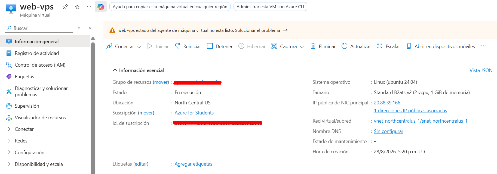
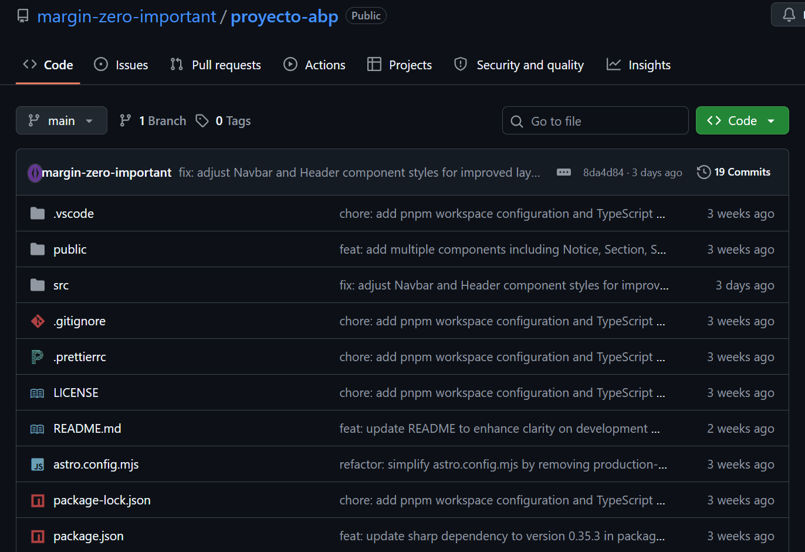
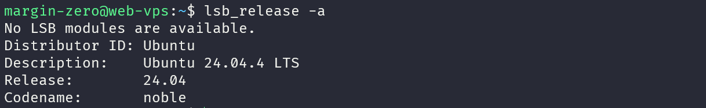
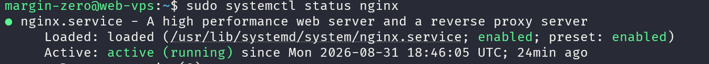
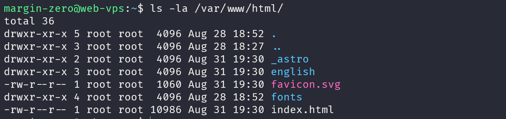
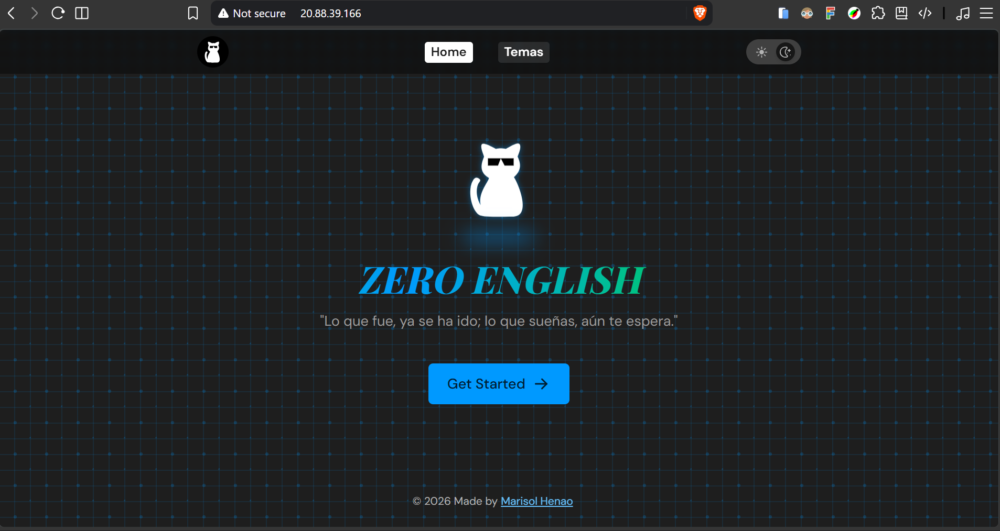

# 💡 Taller APB / Zero English 🗣️


<!-- Descripción -->

<details open>
<summary style="margin-bottom: 32px;">
  <h2 style="display: inline; font-size: 1.5em; margin: 0;">📝 Descripción</h2>
</summary>


**Zero English** es una plataforma web para el aprendizaje de inglés, desarrollada con **Astro** y orientada a organizar y presentar contenidos educativos de manera estructurada y accesible desde cualquier dispositivo con conexión a Internet.

El proyecto surge a partir de la necesidad de solucionar el problema de tener apuntes, ejercicios y recursos de aprendizaje almacenados únicamente en el computador personal. Esta situación dificulta el acceso desde otros dispositivos, el mantenimiento de los contenidos y la disponibilidad de la información.

La solución consiste en una aplicación web estática cuyos contenidos educativos se escriben utilizando **Markdown** y son transformados por Astro en páginas HTML, CSS y JavaScript durante el proceso de construcción (*build*).

El proyecto se desarrolló inicialmente como un **MVP**, comenzando con el tema del *Alfabeto*. Posteriormente, se contempla incorporar nuevos temas de inglés y otros contenidos relacionados.

</details>

<!-- Arquitectura -->

<details>
<summary style="margin-bottom: 32px;">
  <h2 style="display: inline; font-size: 1.5em; margin: 0;">🧱 Arquitectura</h2>
</summary>

La arquitectura implementada utiliza una aplicación web estática desplegada en un servidor virtual de **Microsoft Azure**.

El flujo general es el siguiente:

```text
┌─────────────────────────┐
│        Usuario          │
│   Navegador web/móvil   │
└────────────┬────────────┘
             │ HTTP/HTTPS
             ▼
┌─────────────────────────┐
│     IP pública Azure    │
└────────────┬────────────┘
             │
             ▼
┌─────────────────────────┐
│    Microsoft Azure      │
│    Servidor Linux       │
│         Nginx           │
└────────────┬────────────┘
             │ Archivos estáticos
             ▼
┌─────────────────────────┐
│      Astro - build      │
│       HTML/CSS/JS       │
└────────────┬────────────┘
             │
             ▼
┌─────────────────────────┐
│   Contenidos Markdown   │
│   + recursos estáticos  │
└─────────────────────────┘
             ▲
             │
┌─────────────────────────┐
│         GitHub          │
│ Código fuente y Git     │
└─────────────────────────┘
```

### 🛠️ Tecnologías utilizadas

| Componente                 | Tecnología                    |
| -------------------------- | ----------------------------- |
| Generador de la web        | Astro                         |
| Contenido                  | Markdown / Content Collections|
| Estilos                    | Tailwind CSS                  |
| Control de versiones       | Git + GitHub                  |
| Proveedor cloud            | Microsoft Azure               |
| Entorno de ejecución/build | Node.js                       |
| Servidor web               | Nginx                         |
| Sistema operativo          | Ubuntu Server 24.04           |
| Acceso remoto              | SSH                           |

La arquitectura utiliza un enfoque estático porque el proyecto no requiere actualmente una base de datos, autenticación ni procesamiento dinámico en el servidor. Después de ejecutar el proceso de `build`, Astro genera los archivos que Nginx puede servir directamente a los usuarios.

Esto permite reducir el consumo de recursos del servidor, simplificar el mantenimiento y disminuir la superficie de ataque.

El acceso público se realiza directamente mediante la **IP pública de la máquina virtual de Azure**, sin utilizar un dominio ni configuración DNS para esta entrega.

</details>

<!-- Instrucciones de despliegue -->

<details>
<summary style="margin-bottom: 32px;">
  <h2 style="display: inline; font-size: 1.5em; margin: 0;">☁️ Instrucciones de despliegue</h2>
</summary>

### 1. Configuración de puertos

Para permitir el acceso al sitio desde Internet, en la configuración de red de la máquina virtual de Azure se habilitaron los puertos:

- **22:** SSH para la administración remota.
- **80:** HTTP para el acceso web.
- **443:** HTTPS, habilitado para permitir conexiones seguras si se utiliza posteriormente un certificado SSL.

Para esta entrega, el acceso al sitio se realiza mediante la **IP pública del servidor**, por ejemplo:

```text
http://<IP_PUBLICA>
```

No se utiliza DNS ni un dominio personalizado.

### 2. Crear y acceder al servidor de Microsoft Azure

Se utiliza una máquina virtual de **Microsoft Azure**, obtenida mediante el beneficio disponible en el **GitHub Student Developer Pack**.

El acceso administrativo al servidor se realiza mediante SSH:

```bash
ssh -i ~/.ssh/<AZURE_KEY> <USUARIO>@<IP_PUBLICA>
```

Los valores `<AZURE_KEY>`, `<USUARIO>` e `<IP_PUBLICA>` deben reemplazarse por los correspondientes a la máquina virtual.

### 3. Instalar y configurar Nginx

Se actualiza la lista de paquetes del sistema y se instala Nginx como servidor web:

```bash
sudo apt update
sudo apt install nginx -y
```

Se comprueba que el servicio esté funcionando:

```bash
sudo systemctl status nginx
```

>(Si se ve un punto verde que dice active (running), todo va perfecto. Para salir de ese estado se presiona la tecla q).

Los archivos de la web deben ir en la carpeta (por defecto hay un archivo con extensión `.html`):

```bash
ls -la /var/www/html/
```

>(Al pegar la IP pública de la máquina virtual en el navegador se debería poder ver una página de bienvenida de Nginx, eso indica que el servidor en la nube está funcionando perfecto ya que es públicamente accesible desde Internet)

### 4. Instalar Node.js

Node.js se utiliza para instalar las dependencias del proyecto y ejecutar el proceso de construcción de Astro.

Se instala Node.js:

```bash
curl -fsSL https://deb.nodesource.com/setup_lts.x | sudo -E bash -
sudo apt install -y nodejs
```

La instalación se verifica mediante:

```bash
node --version
npm --version
```

### 5. Obtener el proyecto

El proyecto se encuentra versionado en GitHub. Desde el servidor se obtiene el código fuente mediante Git:

```bash
git clone <URL_DEL_REPOSITORIO>
cd <NOMBRE_DEL_PROYECTO>
```

>(Se clona en una carpeta temporal, por ejemplo, se puede clonar en el directorio personal: `~`)

### 6. Instalar dependencias y generar el proyecto

Una vez dentro del proyecto, se instalan las dependencias:

```bash
npm install
```

Posteriormente se genera la versión de producción:

```bash
npm run build
```

>(Este proceso genera la carpeta `dist/`, que contiene los archivos estáticos que serán publicados.)

### 7. Mover los archivos de la carpeta `dist/` hacia la ruta pública de Nginx:

Después de generar el proyecto, los archivos de la carpeta `dist/` se copian al directorio público utilizado por Nginx:

```bash
sudo rm -rf /var/www/html/*
```

```bash
sudo cp -r dist/* /var/www/html/
```

>(Este comando debe ejecutarse estando dentro de la carpeta del proyecto, donde se ha generado `dist/`)

Se puede verificar el contenido publicado con:

```bash
ls -la /var/www/html/
```

### 8. Actualización del sitio

Cuando se realizan cambios en el proyecto, se obtiene la nueva versión desde GitHub, se reconstruye la aplicación, se hace limpieza por si hay archivos huérfanos en Nginx y se actualizan los archivos:

```bash
git pull
npm install
npm run build
sudo rm -rf /var/www/html/*
sudo cp -r dist/* /var/www/html/
```

De esta manera, GitHub funciona como repositorio y control de versiones, mientras que Azure aloja la versión publicada de la aplicación.

</details>

<!-- Evidencias -->

<details>
<summary style="margin-bottom: 32px;">
  <h2 style="display: inline; font-size: 1.5em; margin: 0;">🕵️‍♀️ Evidencias</h2>
</summary>

Para demostrar el desarrollo y despliegue del proyecto se presentan las siguientes evidencias:

### 1. Máquina virtual de Microsoft Azure



### 2. Repositorio de GitHub



### 3. Conexión por SSH a Azure

```bash
ssh -i ~/.ssh/<AZURE_KEY> <USUARIO>@<IP_PUBLICA>
```

**Información del sistema:**

```bash
lsb_release -a
```



### 4. Nginx funcionando

**Servidor activo:**

```bash
sudo systemctl status nginx
```



### 5. Sitio desplegado

**Nginx directorio:**

```bash
ls -la /var/www/html/
```



**Zero English funcionando:**



</details>